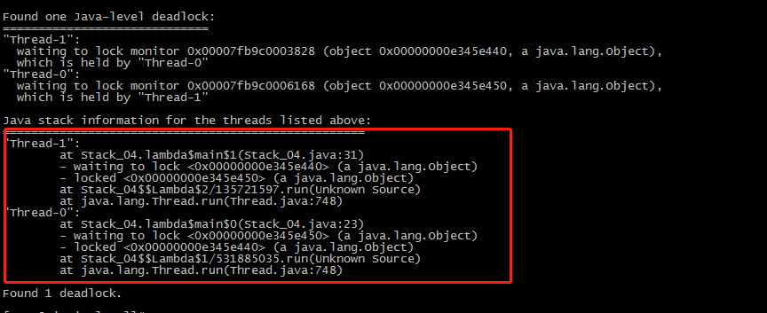
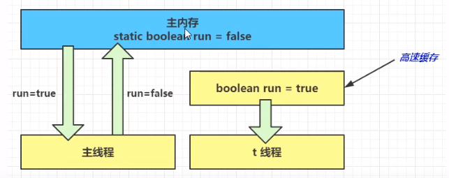

# JVM-Java虚拟机

## 1.内存结构

### 1.1.程序计数器

#### 1.1.1.定义

Program Counter Register**程序计数器(寄存器)**

#### 1.1.2.作用

```.java
二进制指令      JVM指令	源代码
0:getstatic    #20      // PrintStream out = System.out;
3:astore_1           	// --
4:aload_1				// out.println(1);
5:iconst_1     		    // --
6:invokevirtual#26  	// --
9:aload_1				// out.println(2);
10:iconst_2				// --
11:invokevirtual #26	// --
```

二进制指令--》解释器--》机器码--》CPU

作用：保存线程执行的Jvm指令地址，让线程下一次执行的时候知道执行的位置；

#### 1.1.3.特点

1.线程私有

2.不存在内存溢出

### 1.2.虚拟机栈


#### 1.2.1.定义

**Java Virtual Machine Stacks (Java虚拟机栈)**

存储信息：参数、存储局部变量表、操作数栈、动态连接、方法返回地址；

1.每个线程运行时所需要的内存，称为虚拟机栈；

2.每个栈由多个栈帧(Frame)组成，对应着每次方法调用时所需要的内存；

3.每个线程只能有一个活动的栈帧，对应当前的执行方法；

#### 1.2.2.问题辨析

1.垃圾回收是否涉及栈内存？

**垃圾回收不会涉及栈内存**

2.栈内存分配越大越好吗？

栈默认的大小为1024KB--Linux，macOs，windows依赖虚拟内存；

并不是越大越好，越大只能说明能够更多的递归方法调用，但是会减少执行的线程数；比如：100M的内存，如果栈大小为1M则可以创建100条线程，如果栈大小为2M，则只能创建50条线程；

3.方法内的局部变量是否线程安全？

	* 如果方法内局部变量没有逃离方法的作用访问，则是线程安全的；
	* 如果局部变量引用了对象，并逃离了方法的作用范围，则不是线程安全的；

测试代码：

```.java
/**
 * 局部变量线程安全问题
 */
public class Stack_01 {
    public static void main(String[] args) {
        StringBuilder sb = new StringBuilder();
        sb.append(1);
        sb.append(2);
        // 方法m2和m3存在线程安全问题
        new Thread(() -> m2(sb)).start();
        new Thread(() -> m3(sb)).start();
    }
    // 不会出现线程安全的问题
    public static void m1() {
        StringBuilder sb = new StringBuilder();
        sb.append(1);
        sb.append(2);
        sb.append(3);
        System.out.println(sb.toString());
    }
    // 存在线程安全问题
    public static void m2(StringBuilder sb) {
        sb.append(1);
        sb.append(2);
        sb.append(3);
        System.out.println(sb.toString());
    }
    // 内存线程安全问题
    public static StringBuilder m3(StringBuilder sb) {
        sb.append(1);
        sb.append(2);
        sb.append(3);
        return sb;
    }
}
```


#### 1.2.3.栈内存溢出

1.方法递归调用，超过了内存的大小，例如：

```.java
/**
 * 栈内存溢出 Xss256k
 * java.lang.StackOverflowError
 */
public class Stack_02 {
    private static int i;

    public static void main(String[] args) {
        try {
            method();
        } catch (Throwable e) {
            e.printStackTrace();
            System.out.println("递归次数：" + i);
        }
    }

    public static void method() {
        i++;
        method();
    }
}
```

#### 1.2.4.线程运行诊断

案例一：cpu占用过多  --  死循环

Java代码：

```.java
package com.itcm.jvm;

/**
 * cpu占用很高 死循环
 *
 */
public class Stack_03 {
    private static int i;

    public static void main(String[] args) {
        Thread thread = new Thread(() -> {
            while (true) {
                System.out.println("死循环中.......");
            }
        });
        thread.setName("t_stack");
        thread.start();
    }
}
```


* 定位：

  1.用top定位哪个进程对cpu占用很高：top

  

  2.用ps命令查看哪个线程占用cpu很高：

  ps H -eo pid,tid,%cpu | grep 进程ID   --  查看进程ID,线程ID,CPU占用情况  --  将十进制的线程ID转换为16进制的值，与jstack pid命令的结果对比，找到对应出现问题的代码；

  

  3.jstack  进程ID   --  查看进程中的线程信息  可以根据线程ID找到有问题的代码信息；

  

案例二：程序运行很长时间  -- 死锁(deadlock)

代码：

```.java
/**
 * cpu占用很高 死锁 -- deadlock
 *
 */
public class Stack_04 {

    static Object a = new Object();
    static Object b = new Object();

    public static void main(String[] args) throws InterruptedException {
        new Thread(() -> {
            synchronized (a) {
                try {
                    TimeUnit.SECONDS.sleep(2);
                } catch (InterruptedException e) {
                    e.printStackTrace();
                }
                synchronized (b) {
                   System.out.println("线程1:" + Thread.currentThread().getName());
               }
            }
        }).start();
        TimeUnit.SECONDS.sleep(1);
        new Thread(() -> {
            synchronized (b) {
                synchronized (a) {
                    System.out.println("线程2:" + Thread.currentThread().getName());
                }
            }
        }).start();
    }
}
```



### 1.3.本地方法栈 -- Native Methed Stacks

### 1.4.堆 -- Heap

#### 1.4.1.定义

* 通过new关键字，创建对象都会使用堆内存

特点

* 线程共享的，堆中对象都需要考虑线程安全问题
* 有垃圾回收机制

#### 1.4.2.堆内存溢出

测试代码：

```.java
/**
 * 堆内存溢出  --- java.lang.OutOfMemoryError: Java heap space
 * -Xmx10m
 */
public class Heap_01 {
    public static void main(String[] args) {
        int i = 0;
        try {
            ArrayList<Object> list = Lists.newArrayList();
            String str = "hello heap";
            while (true) {
                str = str + str;
                i++;
                list.add(str);
            }
        } catch (Throwable throwable) {
            throwable.printStackTrace();
            System.out.println(i);
        }
    }
}
```

异常信息：

```.java
java.lang.OutOfMemoryError: Java heap space
	at java.util.Arrays.copyOf(Arrays.java:3332)
	at java.lang.AbstractStringBuilder.ensureCapacityInternal(AbstractStringBuilder.java:124)
	at java.lang.AbstractStringBuilder.append(AbstractStringBuilder.java:448)
	at java.lang.StringBuilder.append(StringBuilder.java:136)
	at com.itcm.jvm.Heap_01.main(Heap_01.java:18)
16
```


#### 1.4.2.堆内存诊断

1.jps工具

* 查看当前系统中有哪些java进程

2.jmap工具

* 查看堆内存使用情况 jmap -heap 进程ID

* C:\Program Files\Java\jdk1.8.0_131\bin>jmap -heap 5784
  Attaching to process ID 5784, please wait...
  Debugger attached successfully.
  Server compiler detected.
  JVM version is 25.131-b11

  using thread-local object allocation.
  Parallel GC with 4 thread(s)

  Heap Configuration:
     MinHeapFreeRatio         = 0
     MaxHeapFreeRatio         = 100
     MaxHeapSize              = 1038090240 (990.0MB)
     NewSize                  = 21495808 (20.5MB)
     MaxNewSize               = 346030080 (330.0MB)
     OldSize                  = 43515904 (41.5MB)
     NewRatio                 = 2
     SurvivorRatio            = 8
     MetaspaceSize            = 21807104 (20.796875MB)
     CompressedClassSpaceSize = 1073741824 (1024.0MB)
     MaxMetaspaceSize         = 17592186044415 MB
     G1HeapRegionSize         = 0 (0.0MB)

  Heap Usage:
  PS Young Generation
  Eden Space:
     capacity = 16252928 (15.5MB)
     used     = 525008 (0.5006866455078125MB)
     free     = 15727920 (14.999313354492188MB)
     3.2302364226310485% used
  From Space:
     capacity = 2621440 (2.5MB)
     used     = 0 (0.0MB)
     free     = 2621440 (2.5MB)
     0.0% used
  To Space:
     capacity = 2621440 (2.5MB)
     used     = 0 (0.0MB)
     free     = 2621440 (2.5MB)
     0.0% used
  PS Old Generation
     capacity = 43515904 (41.5MB)
     used     = 1024416 (0.976959228515625MB)
     free     = 42491488 (40.523040771484375MB)
     2.354118622929217% used

  1740 interned Strings occupying 157152 bytes.

\#dump jvm二进制的内存详细使用情况 （效果同在Tomcat的catalina.sh中添加 set JAVA_OPTS=%JAVA_OPTS% -server -XX:+HeapDumpOnOutOfMemoryError -XX:HeapDumpPath=/home/heapdump  此文件需要借用内存分析工具如：Memory Analyzer (MAT)来分析）

 **jmap -dump:format=b,file=/home/$pid/jmapdump.txt $pid**

3.jconsole工具

* 图形化界面，连续监控

4.jvisualvm工具

### 1.5.方法区

#### 1.5.1.定义

#### 1.5.2.组成


#### 1.5.3.方法区内存溢出

* 1.8以前会导致永久代内存溢出

  ```.xml
  * 演示永久代内存溢出  java.lang.OutOfmemoryError：PerGen space
  * -XX:MaxPermSize=8m
  ```

* 1.8之后会导致元空间内存溢出

  ```.xml
  * 演示元空间内存溢出  java.lang.OutOfmemoryError：Metaspace
  * -XX:MaxMetaspaceSize=8m
  ```

  

代码示例：

```.java
/**
 * 方法区 内存溢出  Exception in thread "main" java.lang.OutOfMemoryError: Metaspace
 * -XX:MaxMetaspaceSize=10m 设置元空间参数
 * 加载类的二进制字节码
 */

public class MethodArea_01 extends ClassLoader {

    public static void main(String[] args) {
        int j = 0;
        try {
            MethodArea_01 test = new MethodArea_01();
            for (int i = 0; i< 10000; i++, j++) {
                // 生成类的二进制字节码
                ClassWriter cw = new ClassWriter(0);
                // 版本号，public，类名，包名，父类，接口
                cw.visit(Opcodes.V1_8, Opcodes.ACC_PUBLIC, "Class_" + i, null,"java/lang/Object", null);
                // 返回byte[]
                byte[] bytes = cw.toByteArray();
                // 执行类的加载
                test.defineClass("Class_" + i, bytes, 0, bytes.length);
            }
        } catch (Exception e) {

        } finally {
            System.out.println(j);
        }
    }
}
```

异常信息：

```.java
8011
Exception in thread "main" java.lang.OutOfMemoryError: Metaspace
	at java.lang.ClassLoader.defineClass1(Native Method)
	at java.lang.ClassLoader.defineClass(ClassLoader.java:763)
	at java.lang.ClassLoader.defineClass(ClassLoader.java:642)
	at com.itcm.jvm.MethodArea_01.main(MethodArea_01.java:26)
```

#### 1.5.4.运行时常量池

* 常量池，就是一张表，虚拟机指令根据这张常量表找到要执行的类名、方法名、参数类型、字面量等信息；
* 运行时常量池，常量池是*.class文件中的，当该类被加载，它的常量池信息就会放入运行时常量池，并把里面的符号地址变为真实地址；

#### 1.5.5.运行时常量池面试题 -- StringTable

```java
public class StringTable_01 {
    /**
     * StringTable ["a", "b", "ab"]  -- HashTable结构，不能扩容
     * 常量池中的信息，都会被加载到运行时常量池中，这时a，b，ab都是常量池中的符号，还没有变为java字符串对象
     * @param args
     */
    public static void main(String[] args) {
        String s1 = "a"; // 惰性的
        String s2 = "b";
        String s3 = "a" + "b"; // 在编译期间被优化，结果已经为ab
        // new StringBuilder.append("a").append("b").toString(); -->new String(value, 0, count); 存在于堆中
        String s4 = s1 + s2;
        String s5 = "ab";
        String s6 = s4.intern();

        // 面试题 问？
        System.out.println("s3==s4:" + (s3 == s4)); // false
        System.out.println("s3==s5:" + (s3 == s5)); // true
        System.out.println("s3==s6:" + (s3 == s6)); // true
        System.out.println("s5==s6:" + (s5 == s6)); // true
 
        String x1 = new String("c") + new String("d");
        String x2 = "cd";
        //x2.intern();

        System.out.println("x1==x2:" + (x1 == x2)); // false
    }
}
```

#### 1.5.6.字符串常量池 -- StringTable

* 常量池中的字符串仅仅是符号，第一次用到时才变为对象
* 利用串池的机制，来避免重复创建字符串对象
* 字符串变量拼接的原理是StringBuilder  （JDK 1.8）
* 字符串常量拼接的原理是编译器优化
* 可以使用intern方法，主动将串池中还没有的字符串放入字符串常量池中
  * JDK1.8 将字符串对象尝试放入字符串常量池中，如果存在不会放入，不存在则放入,会把常量池中的对象返回
  * JDK1.6 将字符串对象尝试放入字符串常量池中，如果存在不会放入，不存在则把此对象复制一份放入字符串常量池中，本身不变,会把常量池中的对象返回

```java
public class StringTable_02 {
    public static void main(String[] args) {
        // StringTable ["a", "b"]  -- HashTable结构，不能扩容
        // 创建的a、b在字符串常量池中,new String("ab") -- 堆中
        String s = new String("a") + new String("b");
        String intern = s.intern();// 将字符串对象尝试放入字符串常量池中，如果存在不会放入，不存在则放入,会吧常量池中的对象返回
        System.out.println(intern == "ab"); // true
    }
}
```

#### 1.5.7.字符串常量池 -- StringTable位置

* jdk1.8 存在于堆中
* jdk1.6 存在于永久代中

```java
/**
 * 演示StringTable位置
 * jdk8 -Xmx10m -XX:-UseGCOverheadLimit
 * 不设置 第二个参数，异常信息为：
 * Connected to the target VM, address: '127.0.0.1:52540', transport: 'socket'
 * 142095
 * Exception in thread "main" java.lang.OutOfMemoryError: GC overhead limit exceeded
 * 	at java.lang.Integer.toString(Integer.java:403)
 * 	at java.lang.String.valueOf(String.java:3099)
 * 	at com.itcm.jvm.StringTable_03.main(StringTable_03.java:18)
 * 	超过98%的时间用来做GC并且回收了不到2%的堆内存时会抛出此异常
 * jdk6 -XX:MaxPermSize=10m  设置永久代大小
 */
public class StringTable_03 {
    public static void main(String[] args) {
        List<String> list = Lists.newArrayList();
        int i = 0;
        try {
            for (int j = 0; j < 260000; j++) {
                list.add(String.valueOf(j).intern());
                i++;
            }
        } catch (Exception e) {
            e.printStackTrace();
        } finally {
            System.out.println(i);
        }
    }
}

```

#### 1.5.8.StringTable--垃圾回收

```java
/**
 * 演示StringTable 垃圾回收
 * jdk8 -Xmx10m
 * -XX:+PrintStringTableStatistics 在JVM进程退出时，打印出StringTable的统计信息输出到gclog中
 * -XX:+PrintGCDetails  打印gc信息
 * -verbose:gc  表示输出虚拟机中GC的详细情况
 * -XX:StringTableSize=200000  设置字符串常量池的大小
 * StringTable statistics:
 * Number of buckets       :     60013 =    480104 bytes, avg   8.000  // 容量
 * Number of entries       :      1839 =     44136 bytes, avg  24.000  // 存储的数据
 * Number of literals      :      1839 =    161904 bytes, avg  88.039
 * Total footprint         :           =    686144 bytes
 * Average bucket size     :     0.031
 * Variance of bucket size :     0.031
 * Std. dev. of bucket size:     0.175
 * Maximum bucket size     :         2
 */
public class StringTable_04 {
    public static void main(String[] args) {
        String s = "a";
        try {
            for (int i = 0; i < 100000; i++) {
                System.out.println(String.valueOf(i).intern());
            }
        } catch (Throwable e) {
            e.printStackTrace();
        } finally {
        }
    }
}
```

#### 1.5.9.StringTable--性能调优

* 调整 -XX:StringTabelSize=桶个数
* 考虑将字符串对象是否入池

### 1.6.直接内存

#### 1.6.1.定义

Direct Memory

* 常见于NIO操作时，用于数据缓冲区
* 分配回收成本较高，但读写性能高
* 不受JVM内存回收管理

传统IO：


NIO模型：


#### 1.6.2.内存溢出

```java
/**
 * 直接内存溢出
 * Exception in thread "main" java.lang.OutOfMemoryError: Java heap space
 *     at java.nio.HeapByteBuffer.<init>(HeapByteBuffer.java:57)
 *     at java.nio.ByteBuffer.allocate(ByteBuffer.java:335)
 *     at com.itcm.jvm.DirectMemory_01.main(DirectMemory_01.java:18)
 */
public class DirectMemory_01 {

    private static final int _100M = 1024 * 1024 * 100;

    public static void main(String[] args) {
        ArrayList<ByteBuffer> list = Lists.newArrayList();
        int j = 0;
        try {
            for (int i = 0; i < 100; i++, j++) {
                ByteBuffer buffer = ByteBuffer.allocate(_100M);
                list.add(buffer);
            }
        } catch (Throwable e) {
            e.printStackTrace();
            System.out.println(j);
        }
    }
}
```

#### 1.6.3.分配和回收原理

* 使用了Unsafe对象完成直接内存的分配回收，并且回收需要主动调用freeMemory
* ByteBuffer的实现类内部，使用了Cleaner(虚引用)来监测ByteBuffer对象，一旦ByteBuffer对象被垃圾回收，那么就会由ReferenceHanlder线程通过Cleaner的clean方法调用freeMemory来释放直接内存

## 2.垃圾回收

### 2.1.如何判断对象可以回收

#### 2.1.1.引用计数法

问题：循环引用，不能被回收

#### 2.1.2.可达性分析算法

* Java虚拟机中的垃圾收集器采用可达性分析来探索所有存活的对象
* 扫描堆中的对象，看是否能够沿着Gc Root对象为起点的引用链找到该对象，找不到，表示可以回收
* 哪些对象可以作为GC Root？
  * 虚拟机栈中，局部变量引用的对象
  * 方法区，类静态属性的引用
  * 方法区，常量对象的引入
  * 本地方法栈，Native方法对象的引入
  * 加锁对象的引入

#### 2.1.3.四种引用

1.强引用

* 只有所有GC Roots对象都不通过【强引用】引用该对象，该对象才能被垃圾回收

2.软引用(SoftReference)

* 仅有软引用引用该对象时，在垃圾回收后，内存仍不足时会再次触发垃圾回收，回收软引用对象
* 可以配合引用队列释放软引用自身

3.弱引用(WeakReference)

* 仅有弱引用引用该对象时，在垃圾回收时，无论内存是否充足，都会回收弱引用对象
* 可以配合引用队列来释放弱引用自身

4.虚引用(PhantomReference)

* 必须配合引用队列使用，主要配合ByteBuffer引用，被引用对象回收时，会将虚引用入队，由Reference Handler线程调用虚引用相关方法释放直接内存

5.终结器引用(FinalReference)

* 无需手动编码，但其内部配合引用队列使用，在垃圾回收时，终结器引用入队(被引用对象暂时没有被回收)，

  在由Finalizer线程通过终结器引用找到被引用对象并调用它的finalize方法，第二次gc时才能被回收

```java
/**
 * 软引用测试 -Xmx20m
 */
public class SoftReference_01 {

    private static final int _4M = 1024 * 1024 * 4;

    public static void main(String[] args) {
//        strong();
        soft();
    }

    // 强引用 -- 抛出异常java.lang.OutOfMemoryError: Java heap space
    public static void strong() {
        List<byte[]> list = Lists.newArrayList();
        for (int i = 0; i < 5; i++) {
            list.add(new byte[_4M]);
        }
    }

    // 弱引用 -- 不会抛出异常
    public static void soft() {
        List<SoftReference<byte[]>> list = Lists.newArrayList();
        for (int i = 0; i < 5; i++) {
            SoftReference<byte[]> softReference = new SoftReference<>(new byte[_4M]);
            System.out.println(softReference.get());
            list.add(softReference);
            System.out.println(list.size());
        }
        System.out.println("循环结束:" + list.size());
        for (SoftReference<byte[]> reference : list) {
            System.out.println(reference.get());
        }
    }
}
```

### 2.2.垃圾回收算法

#### 2.2.1.标记清除


过程：1.标记没有Gc Roots引用的对象 2.清除没有使用的内存空间

缺点：**产生内存碎片，如果下次要分配较大的内存，则不能分配**

#### 2.2.2.标记整理


过程：1.标记没有被Gc Roots引用的对象 2.整理：将没有被回收的对象移动到一段，减少内存碎片

优缺点：**不会产生内存碎片，过程复制，需要更多的时间，比如修改引用对象的内存地址等**

#### 2.2.3.复制算法


过程：1.标记没有被Gc Roots引用的对象 2.复制：将没有被回收的对象移动到另一块内存空间，清除之前的内存空间

优缺点：占用双倍内存空间

### 2.3.分代垃圾回收

#### 2.3.1.分代GC


* 对象首先分布在iden(伊甸园)区域
* 新生代空间不足时，触发minor GC，伊甸园和from存活的对象使用copy算法复制到to survivor区中，存活的对象年龄+1，并且交换From Survivor和To Survivor
* minor gc会引发stop the world，暂停其他用户线程，等垃圾回收结束后，其他线程恢复运行
* 当对象寿命超过阈值时，会晋升到老年代，最大寿命为15(4bit)
* 当老年代空间不足时，会先触发minor gc，如果之后空间任然不足，则会触发full gc，暂停其他用户线程时间更长，full gc之后空间仍然不足，则抛出OutOfMemory异常

#### 2.3.2.JVM相关参数

| 含义             | 参数                                                       |
| ---------------- | ---------------------------------------------------------- |
| 堆初始化大小     | -Xms10m                                                    |
| 堆最大大小       | -Xmx512m或-XX:MaxHeapSize=512m                             |
| 新生代大小       | -Xmn10m或(-XX:NewSize=10m  \|  -XX:MaxNewSize=10m)         |
| 幸存区比例(动态) | -XX:InitialSurvivorRatio=8:1:1和-XX:+UseAdaptiveSizePolicy |
| 幸存区比例       | -XX:SurvivorRatio=8:1:1                                    |
| 晋升阈值         | -XX:MaxTenuringThreshold=15                                |
| 晋升详情         | -XX:+PrintTenuringDistribution                             |
| GC详情           | -XX:+PringGCDetails  -verbose:gc                           |
| FullGC前MinorGC  | -XX:+ScavengeBeforeFullGC                                  |
| 设置垃圾回收器   | -XX:+UseSerialGC                                           |

### 2.4.垃圾回收器

#### 2.4.1.串行

* 单线程
* 堆内存较小，适合个人电脑  -- cpu个数少
* -XX:+UseSerialGC = Serial(新生代)  + SerialOld(老年代)


串行收集器组合Serial + Serial Old

```.xml
开启选项：-XX:+SerialGC
```

串行收集器是最基本、发展时间最长、久经考验的垃圾收集器，也是client模式下的默认收集器配置。

串行收集器采用单线程stop-the-world的方式进行收集。当内存不足时，串行GC设置停顿标识，待所有线程都进入安全点(Safepoint)时，应用线程暂停，串行GC开始工作，采用单线程方式回收空间并整理内存。单线程也意味着复杂度更低、占用内存更少，但同时也意味着不能有效利用多核优势。事实上，串行收集器特别适合堆内存不高、单核甚至双核CPU的场合。

#### 2.4.2.吞吐量优先 -- 并行

* 多线程
* 堆内存较大，多核cpu
* 让单位时间内，其他线程暂停时间最短


并行收集器组合 Parallel Scavenge + Parallel Old  (JDK 7 8 默认垃圾收集器)

```.xml
开启选项：-XX:+UseParallelGC或-XX:+UseParallelOldGC(可互相激活)
```

并行收集器是以关注吞吐量为目标的垃圾收集器，也是server模式下的默认收集器配置，对吞吐量的关注主要体现在年轻代Parallel Scavenge收集器上。

并行收集器与串行收集器工作模式相似，都是stop-the-world方式，只是暂停时并行地进行垃圾收集。年轻代采用复制算法，老年代采用标记-整理，在回收的同时还会对内存进行压缩。关注吞吐量主要指年轻代的Parallel Scavenge收集器，通过两个目标参数`-XX:MaxGCPauseMills`和`-XX:GCTimeRatio`，调整新生代空间大小，来降低GC触发的频率。并行收集器适合对吞吐量要求远远高于延迟要求的场景，并且在满足最差延时的情况下，并行收集器将提供最佳的吞吐量。

#### 2.4.3.响应时间优先 -- 并发标记清除收集器

* 多线程
* 堆内存较大，多核cpu
* 尽可能单次内让其他线程暂停时间最短


并发标记清除收集器组合 ParNew + CMS + Serial Old

```.xml
开启选项：-XX:+UseConcMarkSweepGC
```

并发标记清除(CMS)是以关注延迟为目标、十分优秀的垃圾回收算法，开启后，年轻代使用STW式的并行收集，老年代回收采用CMS进行垃圾回收，对延迟的关注也主要体现在老年代CMS上。

年轻代ParNew与并行收集器类似，而老年代CMS每个收集周期都要经历：**初始标记、并发标记、重新标记、并发清除**。其中，初始标记以STW的方式标记所有的根对象；并发标记则同应用线程一起并行，标记出根对象的可达路径；在进行垃圾回收前，CMS再以一个STW进行重新标记，标记那些由mutator线程(指引起数据变化的线程，即应用线程)修改而可能错过的可达对象；最后得到的不可达对象将在并发清除阶段进行回收。**值得注意的是，初始标记和重新标记都已优化为多线程执行**。CMS非常适合堆内存大、CPU核数多的服务器端应用，也是G1出现之前大型应用的首选收集器。

但是CMS并不完美，它有以下缺点：

1. 由于并发进行，CMS在收集与应用线程会同时会增加对堆内存的占用，也就是说，CMS必须要在老年代堆内存用尽之前完成垃圾回收，否则CMS回收失败时，将触发担保机制，串行老年代收集器将会以STW的方式进行一次GC，从而造成较大停顿时间；
2. 标记清除算法无法整理空间碎片，老年代空间会随着应用时长被逐步耗尽，最后将不得不通过担保机制对堆内存进行压缩。CMS也提供了参数`-XX:CMSFullGCsBeForeCompaction`(默认0，即每次都进行内存整理)来指定多少次CMS收集之后，进行一次压缩的Full GC。

### 2.5.垃圾收集器优化

预备知识

* 掌握GC相关的VM参数，会基本的空间调整
* 掌握相关工具
* 明白一点：调优跟应用、环境有关，没有放之四海而皆准的法则
* "C:\Program Files\Java\jdk1.8.0_131\bin\java" -XX:+PrintFlagsFinal -version | findstr "GC"  查看虚拟机运行参数

#### 2.5.1.调优领域

* 内存
* 锁竞争
* cpu占用
* io

#### 2.5.2.确定目标

* 【低延迟】还是【高吞吐量】，选择合适的回收器
* CMS，G1，ZGC
* ParallelGC
* Zing

#### 2.5.3.最快的GC是不发生GC

* 查看FullGC前后的内存占用，考虑下面几个问题
  * 数据是否太多？
    * resultSet = statement.executeQuery(select * from 大表 limit n)
  * 数据表示是否太臃肿
    * 对象图
    * 对象大小16 Integer 24 int 4
  * 是否存在内存泄漏
    * static Map map
    * 软引用
    * 弱引用
    * 分布式缓存 -- redis

#### 2.5.4.新生代调优

* 新生代特点
  * 所有的new操作的内存分配非常廉价
  * TLAB thread-local allocation buffer  -- 线程局部缓冲区
* 死亡对象的回收代价是零
* 大部分对象用过即死
* Minor GC的时间远远低于Full GC
* 新生代内存越大越好吗？


* 新生代能够容纳【并发数*（请求-响应）】的内存容量

* 幸存区大到能保留【当前活跃对象+需要晋升的对象】

* 晋升阈值配置得当，让长时间存活对象尽快晋升

  * -XX:MaxTenuringThreshold=threshold   调整新生代到老年代的晋升阈值

  * -XX:+PrintTenuringDistribution  打印对象年代信息

    

#### 2.5.5.老年代优化

以CMS为例

* CMS的老年代内存越大越好
* 先尝试不做调优，如果没有FullGC那么已经，否则先尝试调优新生代
* 观察发生Full GC时老年代内存占用，将老年代内存预设调大1/4~1/3
  * -XX:CMSInitiatingOccupancyFraction=percent

#### 2.5.6.案例分析

* 案例1 Full GC和Minor GC频繁
* 案例2 请求高峰期发生Full Gc，单次暂停时间特别长 CMS
* 案例3 老年代充裕情况下，发生Full GC JDK1.7

## 3.类加载机制

### 3.1.加载

* 将类的字节码载入方法区中，内部采用C++的instanceKlass描述java类，它的重要field有：

  * _java_mirror即java的类镜像，例如对String来说，就是String.class，作用是吧class暴露给java是使用
  * _super即父类
  * field即成员变量
  * _methods即方法
  * _constants即常量池
  * _class_loader即类加载器
  * _vtable虚方法表
  * _itable接口方法表

* 如果这个类还有父类没有加载，先加载父类

* 加载和链接可能是交替运动的

  ```xml
  **注意**
  *instanceClass这样的【元数据】是存储在方法区中的(jdk1.8在元空间)，但_java_mirror存在在堆中
  *可以通过前面介绍的HSDB工具查看
  ```

  

### 3.2.链接

* 验证：验证类是否符合JVM规范，安全性检查

  用UE等支持二进制的编译器修改HelloWorld的魔数，在控制台运行

  

* 准备：为static变量分配空间，设置默认值
  * <span style="color:red">**static变量在JDK7之前存储于instanceKclass末尾，从JDK7开始，存储于_java_mirror末尾**</span>
  * <span style="color:red">**static变量分配空间和赋值是两个步骤，分配空间在准备阶段完成，赋值在初始化阶段完成**</span>
  * <span style="color:red">**如果static变量是final的基本类型，那么编译阶段就确定了，赋值在准备阶段完成**</span>
  * <span style="color:red">**如果static变量是final的，但属于引用类型，那么赋值会在初始化阶段完成**</span>
* 解析：将常量池中的符号引用解析为直接引用

### 3.3.初始化

**<cinit>()v方法**

初始化即调用<cinit>()V，虚拟机会保证这个类的【构造方法】的线程安全

**发生的时机**

概括的说，类初始化是【**懒惰的**】

* main方法所在的类，总会被首先初始化
* 首次访问这个类的静态变量或静态方法时
* 子类初始化，如果父类还没有初始化，会引发

* 子类访问父类的静态变量，只会触发父类的初始化
* Class.forName
* new会导致初始化

不会导致初始化的情况：

* 访问类的static final静态常量(基本类型和字符串)不会触发初始化
* 类对象.class不会触发初始化

```java
/**
 * 类的初始化
 */
public class ClassLoad_02 {

    static {
        System.out.println("main init");
    }

    public static void main(String[] args) throws ClassNotFoundException {
        // 1.静态常量不会触发初始化
        System.out.println(B.b);
        // 2.类对象.class不会触发初始化
        System.out.println(B.class);
        // 3.创建该类的数组不会触发初始化
        System.out.println(new B[0]);
        // 4.不会初始化类B，但会加载A B
        ClassLoader loader = Thread.currentThread().getContextClassLoader();
        loader.loadClass("com.itcm.jvm.B");
        // 4.不会初始化类B，但会加载A B
        ClassLoader loader1 = Thread.currentThread().getContextClassLoader();
        Class.forName("com.itcm.jvm.B", false, loader1);


        // 1.首次访问类的静态变量或静态方法
        System.out.println(A.a);
        // 2.子类初始化，如果父类还没有初始化，会触发
        System.out.println(B.c);
        // 3.子类访问父类静态变量，只会触发父类初始化
        System.out.println(B.a);
        // 4.Class.forName()会初始B，并初始化A
        Class.forName("com.itcm.jvm.B");
    }
}

class B extends A {
    public static final int b = 10;
    public static boolean c = false;
    static {
        System.out.println("Class B init");
    }
}

class A {
    public static int a = 10;
    static {
        System.out.println("Class A init");
    }
}
```

### 3.4.类加载器

以JDK8为例：

| 名称                    | 加载哪些类            | 说明                        |
| ----------------------- | --------------------- | --------------------------- |
| Bootstrap ClassLoader   | JAVA_HOME/jre/lib     | 无法直接访问                |
| Extension ClassLoader   | JAVA_HOME/jre/lib/ext | 上级为Bootstrap，显示为null |
| Application ClassLoader | classpath             | 上级为Extension             |
| 自定义类加载器          | 自定义                | 上级为Application           |
|                         |                       |                             |

#### 3.4.1.启动类加载器

#### 3.4.2.扩展类加载器

```java
/**
 * 应用类加载器
 * 输出：
 * loader init
 * sun.misc.Launcher$AppClassLoader@18b4aac2
 */
public class ClassLoad_03 {
    public static void main(String[] args) throws ClassNotFoundException {
        Class<?> aClass = Class.forName("com.itcm.jvm.Load");
        System.out.println(aClass.getClassLoader());
    }
}

class Load {
    static {
        System.out.println("loader init");
    }
}
```

#### 3.4.3.双亲委派模式

所谓的双亲委派，就是指调用类加载器的loadClass方法时，查找类的规则；

```java
protected Class<?> loadClass(String name, boolean resolve)
    throws ClassNotFoundException {
    synchronized (getClassLoadingLock(name)) {
        // First, check if the class has already been loaded  查找该类是否被加载
        Class<?> c = findLoadedClass(name);
        if (c == null) {
            long t0 = System.nanoTime();
            try {
                if (parent != null) {
                    // 有上级类加载器就委派给上级加载
                    c = parent.loadClass(name, false);
                } else {
                    // 如果没有上级Extension加载器，就委派给BoostrapClassLoader
                    c = findBootstrapClassOrNull(name);
                }
            } catch (ClassNotFoundException e) {
                // ClassNotFoundException thrown if class not found
                // from the non-null parent class loader
            }

            if (c == null) {
                // If still not found, then invoke findClass in order
                // to find the class.
                long t1 = System.nanoTime();
                c = findClass(name);

                // this is the defining class loader; record the stats 记录耗时
                sun.misc.PerfCounter.getParentDelegationTime().addTime(t1 - t0);
                sun.misc.PerfCounter.getFindClassTime().addElapsedTimeFrom(t1);
                sun.misc.PerfCounter.getFindClasses().increment();
            }
        }
        if (resolve) {
            resolveClass(c);
        }
        return c;
    }
}
```

#### 3.4.4.线程上下文类加载器

比如我们用的jdbc驱动，com.mysql.jdbc.Driver;

#### 3.4.5.自定义类加载器

## 4.内存模型--JMM

很多人将【java内存结构】与【java内存模型】傻傻分不清，【java内存模型】是java memory model(JMM)的意思。

简单的说，JMM定义了一套在多线程读写共享数据时(成员变量、数组)，对数据的可见性、有序性和原子性的规则和保障。

### 4.1.原子性

#### 4.1.1.问题

问题：两个线程对初始值为0的静态变量一个做自增，一个做自减，各做5000次，结果是0吗？

结果不是；

#### 4.1.2.问题分析

以上的结果可能是正数、负数、零。为什么呢？因为Java中对静态变量的自增，自减并不是原子操作。

例如对于i++而言(i为静态变量)。实际会产生如下的JVM字节码指令：

```java
getstatic     i  // 获取静态变量的i的值
iconst_1         // 准备常量1
iadd			 // 加法
putstatic        // 将修改后的值存入静态变量i    
```

而对于的i--：

```java
getstatic     i  // 获取静态变量的i的值
iconst_1         // 准备常量1
isub			 // 减法
putstatic        // 将修改后的值存入静态变量i    
```

而Java的内存模型如图所示，完成变量i的自增和自减需要在主内存和线程内存中进行数据交换：


如果为单线程执行就不会出现问题；

#### 4.1.3.解决方法

synchronized（同步关键字）

语法:

```java
synchronized(对象) {
    要作为原子操作代码
}
```

```java
public class JMM_01 {
    static Object obj = new Object();
    static int count = 0;

    public static void main(String[] args) throws InterruptedException {
        new Thread(() -> {
            synchronized (obj) {
                for (int i = 0; i < 10; i++) {
                    count++;
                }
            }
        }).start();

        new Thread(() -> {
            synchronized (obj) {
                for (int i = 0; i < 9; i++) {
                    count--;
                }
            }
        }).start();
        Thread.sleep(5000);
        System.out.println(count);
    }
}
```

### 4.2.可见性

#### 4.2.1.退不出的循环

先来看一个现象，Main线程对run变量的修改对于t线程不可见，导致了t线程无法停止：

```java
public class JMM_02 {
    static boolean run = true;

    public static void main(String[] args) throws InterruptedException {
        new Thread(() -> {
            while(run) {

            }
        }).start();
        TimeUnit.SECONDS.sleep(1000);
        run = false; // 线程t不会如预期的停下来
    }
}
```

为什么？分析一下：

1.初始状态，t线程刚开始从主内存读取了run的值到工作内存。


2.因为t线程要频繁从主内存中读取run的值，JIT编译器会将run的值换成至自己工作内存中的高速缓存中，减少对主存中run的访问，提高效率


3. 1秒之后，main线程修改了run的值，并同步至主存，而t是从自己工作内存中的高速缓存中读取这个变量的值，结果永远是旧值
4. 

#### 4.2.2.解决办法

volatile(易变关键字)

它可以用来修饰成员变量和静态成员变量，它可以避免线程从自己的工作缓存中查找变量的值，必须到主内存中获取它的值，线程操作volatile变量都是直接操作主存

#### 4.2.3.可见性

前面例子体现的实际就是可见性，它保证的是在多个线程之间，一个线程对volatile变量的修改对另一个线程可见，不能保证原子性，仅用在一个写线程，多个读线程的情况；

**注意：**

synchronized语句块既可以保证代码块的原子性，也同事保证代码块内变量的可见性。但缺点是synchronized是属于重量级操作，性能相对更低。

如果在前面示例的死循环中加入System.out.println()会发现即使不加volatile修饰符，线程t也能正确看到对run变量的修改了，想一想为什么？

```java
public void println(String x) {
    synchronized (this) { // synchronized会强制从主内存读取值
        print(x);
        newLine();
    }
}
```

### 4.3.有序性

#### 4.3.1.诡异的结果

```java
int num = 0;
boolean ready = false;
// 线程1 执行此方法
public void actor1(I_Result r) {
    if(ready) {
        r.r1 = num + num;
    } else {
        r.r1 = 1;
    }
}

// 线程2执行此方法
public void actor2(I_Result r) {
    num = 2;
    ready = true;
}
```

I_Result是一个对象，有一个属r1用来保存结果，问，可能的结果又几种？

0,1,4  原因：**代码执行存在指令重排现象；**

#### 4.3.2.解决方法

volatile修改的变量可以禁用指令重排

#### 4.4.3.有序性理解

同一个线程内，JVM会在不影响正确性的前提下，可以调整语句的执行顺序，思考下面一段代码：

```java
static int i;
static int j;

// 在某个线程内执行如下赋值操作
i = ...;// 较为耗时的操作
j = ...;
```

可以看到，至于是先执行i还是执行j，对最终的结果不会产生影响，所以，上面的代码真正执行时，既可以是

```java
i = ...;// 较为耗时的操作
j = ...;
```

也可以是

```java
j = ...;
i = ...; // 较为耗时的操作
```

这种特性称为【指令重排】，多线程下【指令重排】会影响正确性，例如著名的double-checked locking模式实现单例

```java
public final class Singleton {
    private Singleton() {}
    private static Singleton INSTANCE = null;
    private static Singleton getInstance() {
        // 实例没有创建，才会进入内部的synchronized代码块
        if(INSTANCE == null) {
            synchronized(Singleton.class) {
                // 也许有其他线程已经创建实例，所以在判断一次
                if(INSTANCE == null) {
                    INSTANCE = new Singleton();
                }
            }
        }
    }
}
```

以上的实现特点是：

* 懒惰实例化
* 首次使用getInstance()才使用synchronized加锁，后续使用时无需加锁

但在多线程环境下，上面代码有问题，INSTANCE = new Singleton()对应的字节码为：

```xml
0: new			#2			// class cn/itcm/jvm/Singleton
3: dup						
4: invokespecial#3			// Method "<init>":()V
7: putstatic    #4			// Field INSTANCE:Lcn/itcm/jvm/Singleton    
```

其中4 7两步的顺序不是固定的，也许jvm会优化为：先将引用地址赋值给INSTANCE变量后，再执行构造方法，如果两个线程t1，t2按如下时间序列执行：

```xml
时间1  t1   线程执行到INSTANCE = new Singleton();
时间2  t1   线程分配空间，为Singleton对象生成了引用地址(0处)
时间3  t1   线程将引用地址赋值给INSTANCE，这时INSTANCE != null （7处）
时间4  t2   线程进入getInstance()方法，发现INSTANCE != null(synchrozined块外)，直接返回INSTANCE
时间5  t1   线程执行Singleton的构造方法(4处)
```

这时t1还未完全将构造方法执行完毕，如果在构造方法中要执行很多初始化操作，那么t2拿到的将是一个未初始化的单例

对INSTANCE使用volatile修饰即可，可以禁用指令重排，但要注意在JDK 5以上的版本的volatile才会真正有效

#### 4.4.4.happens-before

happens-before规定了那些写操作对其他线程的读操作可见，它是可见性与有序性的一套规则总结：

* 线程解锁m之前对变量的写，对于接下来对m加锁的其他线程对该变量的读可见

```java
static int x;
static Object m = new Object();
new Thread(() -> {
    synchronized(m) {
        x = 10;
    }
}, "t1").start();
new Thread(() -> {
    synchronized(m) {
        System.out.println(x);
    }
}, "t2").start();
```

* 线程对volatile变量的写，对接下来其他线程对该变量的读可见

```java
static int x;
x = 10;
new Thread(() -> {
    System.out.println(x);
}).start();
```

* 线程结束前对变量的写，对其他线程得知它结束后读可见(比如其它线程调用t1.isAlive()或t1.join()等待它结束)
* 线程t1打断t2(interrupt)前对变量的写，对于其他线程得知t2被打断后对变量的读可见(通过t2.interrupt或t2.isInterrputed)

### 4.4.CAS与原子类

#### 4.4.1.CAS

CAS即Compare and Swap，它体现的一种乐观锁的思想，比如多个线程要对一个共享的整数变量执行+1操作：

```java
// 需要不断尝试
while(true) {
    int 旧值 = 共享变量; // 比如拿到了当前值0
    int 结果 = 旧值 + 1; // 在旧值的0的 基础上增加1，正确结果是1
    /*
      这时候如果别的线程把共享变量修改成了5，本线程的正确结果 1 就作废	  了，这时候compareAndSwap返回false，重新尝试，直到：
      compareAndSwap返回true，表示我本线程做修改的同事，别的线程没       有干扰
    */
    if(compareAndSwap(旧值，结果)) {
        // 成功，退出循环
    }
}
```

获取共享变量时，为了保证该变量的可见性，使用需要volatile修饰，结果CAS和volatile可以实现无所并发，适合于竞争不激烈，多核cpu的场景下。

* 因为没有使用synchronized，所以线程不会陷入阻塞，这时效率提升的因素之一
* 但如果竞争激烈，可以想到重试必然频繁发生，反而效率会受影响

CAS底层依赖于一个Unsafe类来直接调用操作系统底层的CAS指令，下面是直接使用Unsafe对象进行线程安全保护的一个例子：

#### 4.4.2.乐观锁与悲观锁

* CAS是基于乐观锁的思想：最乐观的估计，不怕别的线程来修改共享变量，就算修改了也没有关系，然后在重试
* synchronized是基于悲观锁的思想：最悲观的估计，得防着其他线程来修改共享变量，我上了锁你们都别想改，等释放了锁，才有机会获取

#### 4.4.3.原子操作类

juc(java.util.concurrent)中提供了原子操作类，可以提供线程安全的操作，例如：atomicInteger、AtomicBoolean等，他们底层就是采用的CAS技术+volatile来实现的。

### 4.5.synchronized优化

Java HotSpot虚拟机中，每个对象都有对象头(包括class指针和Mark Word)。Mark Word平时存储这个对象的哈希码、分代年龄，当加锁时，这些信息就根据情况被替换为标记位、线程锁记录指针、重量级锁指针、线程ID等内容

#### 4.5.1.轻量级锁

如果一个对象虽然有多个线程访问，但多线程访问的时间是错开的(也就是没有竞争)，那么可以使用轻量级锁来优化。这就好比：

学生(线程A)用课本占座，上了半节课，出门了(CPU时间到)，回来一看，发现课本没变，说明没有竞争，继续上他的课。

如果这期间其他学生(线程B)来了，会告知(线程A)有并发访问，线程A随即升级为重量级锁的流程。

而重量级锁就不是那么用课本占座那么简单了，可以想象线程A走之前，把作为用一个铁栅栏围起来，假设有两个方法同步块，利用同一个对象加锁：

```java
static Object obj = new Object();
public static void method1() {
    synchronized(obj) {
        // 同步块A
        method2();
    }
}
public static void method2() {
    synchronized(obj) {
        // 同步块B
    }
}
```

每个线程的栈帧会包含一个锁记录的结构，内部可以存储锁定对象的Mark Word：

| 线程1                                  | 对象Mark Word             | 线程2                                  |
| -------------------------------------- | ------------------------- | -------------------------------------- |
| 访问同步块A，把Mark复制到线程1的锁记录 | 01(无锁)                  | -                                      |
| CAS修改Mark为线程1锁记录地址           | 01(无锁)                  | -                                      |
| 成功(加锁)                             | 00(轻量级)线程1锁记录地址 | -                                      |
| 执行同步块A                            | 00(轻量级)线程1锁记录地址 | -                                      |
| 访问同步块B，把Mark复制到线程1的锁记录 | 00(轻量级)线程1锁记录地址 | -                                      |
| CAS修改Mark为线程1锁记录地址           | 00(轻量级)线程1锁记录地址 | -                                      |
| 失败(发现是自己的锁)                   | 00(轻量级)线程1锁记录地址 | -                                      |
| 锁重入                                 | 00(轻量级)线程1锁记录地址 | -                                      |
| 执行同步块B                            | 00(轻量级)线程1锁记录地址 | -                                      |
| 同步块B执行完毕                        | 00(轻量级)线程1锁记录地址 | -                                      |
| 同步块A执行完毕                        | 00(轻量级)线程1锁记录地址 | -                                      |
| 成功(解锁)                             | 01(无锁)                  | -                                      |
|                                        | 01(无锁)                  | 访问同步块A，把Mark复制到线程2的锁记录 |
|                                        | 01(无锁)                  | CAS修改Mark为线程2锁记录地址           |
|                                        | 00(轻量级)线程2锁记录地址 | 成功(加锁)                             |

#### 4.5.2.锁膨胀

如果在尝试加轻量级锁的过程中，CAS操作无法成功，这时一种情况就是其他线程为此对象加上了轻量级锁(有竞争)，这时需要进行锁膨胀，将轻量级锁变为重量级锁。

```java
static Object obj = new Object();
public static void method1() {
    synchronized(obj) {
        // 同步块
    }
}
```

| 线程1                                 | 对象Mark Word              | 线程2                                  |
| ------------------------------------- | -------------------------- | -------------------------------------- |
| 访问同步块，把Mark复制到线程1的锁记录 | 01(无锁)                   | -                                      |
| CAS修改Mark为线程1锁记录地址          | 01(无锁)                   | -                                      |
| 成功(加锁)                            | 00(轻量级)线程1锁记录地址  | -                                      |
| 执行同步块                            | 00(轻量级)线程1锁记录地址  | -                                      |
| 执行同步块                            | 00(轻量级)线程1锁记录地址  | 访问同步块，把Mark复制到线程2          |
| 执行同步块                            | 00(轻量级)线程1锁记录地址  | CAS修改为线程2锁记录地址               |
| 执行同步块                            | 00(轻量级)线程1锁记录地址  | 失败(发现别人已经占了锁)               |
| 执行同步块                            | 00(轻量级)线程1锁记录地址  | CAS修改Mark为重量锁                    |
| 执行同步块                            | 10(重量级)重量锁指针       | 阻塞中                                 |
| 执行完毕                              | 10(重量级)重量锁指针       | 阻塞中                                 |
| 失败(解锁)                            | 10(重量级)重量锁指针阻塞中 | 阻塞中                                 |
| 释放重量级锁，唤起阻塞线程竞争        | 10(重量级)                 | 阻塞中                                 |
|                                       | 10(重量级)                 | 访问同步块A，把Mark复制到线程2的锁记录 |
|                                       | 10(重量级)                 | CAS修改Mark为线程2锁记录地址           |

#### 4.5.3.重量锁

重量级锁竞争的时候，还可以使用自旋来进行优化，如果当前线程自旋成功，(即这个时候持锁线程已经退出了同步块，释放了锁)，这时当前线程就可以换避免阻塞。

在Java6之后自旋锁是自适应的，比如对象刚刚的一次自旋操作成功过，那么认为这次自旋成功的可能性会高，就多自旋几次，反之，就少自旋甚至不自旋，总之，比较智能。

* 自旋会占用CPU时间，单核CPU自旋就是浪费，多核CPU自旋才能发挥优势
* 好比等红绿灯汽车是不是熄火，不熄火相当于自旋(等待时间短了划算)，熄火了相当于则色(等待时间长了划算)
* Java7之后不能控制是否开启自旋功能

自旋重试成功的情况


自旋重试失败的情况


#### 4.5.4.偏向锁

轻量级锁在没有竞争时(就自己这个线程)，每次重入仍然需要执行CAS操作。Java 6中引入了偏向锁来做进一步优化：只有第一次使用CAS将线程ID设置到对象的Mark Word头，之后发现这个线程ID是自己的就表示没有锁竞争，不在重新CAS

* 撤销偏向锁需要将持有线程升级为轻量级锁，这个过程中所有线程需要暂停
* 访问对象的hashCode也会撤销偏向锁
* 如果对象虽然被多个线程访问，但没有 竞争，这时偏向了线程T1的对象仍然有机会重新偏向T2，重偏向会重置对象的ThreadID
* 撤销偏向和重偏向都是批量进行的，以类为单位
* 如果撤销偏向到达某个阈值，整个类的所有对象都会变成为不可偏向的
* 可以主动使用-XX:-UseBiasedLocking禁用偏向锁

#### 4.5.5.其他优化

**1.减少上锁时间**

同步代码块中尽量短

**2.减少锁的粒度**

将一个锁拆分为多个锁提高并发度，例如：

* ConcurrentHashMap
* LongAdder分为base和cells两部分，没有并发争用的额时候或者是cells数组正在初始化的时候，会使用CAS类累加值到base，有并发争用，会初始化cells数组，数组有多少个cell，就允许有多少线程并行修改，最后将数组中每个cell累加，在加上base就是最终的值
* LinkedBlockingQueue入队和出队使用不同的锁，相当于LinkedBlockingArray只有一个锁效率更高

**3.锁粗化**

多次循环进入同步块不如同步块内多次循环

另外JVM可能会做如下优化，把多次append的加锁操作粗化为一次(因为都是对同一对象加锁，没必要重入多次)

```.java
new StringBuffer().append("a").append("b");
```

#### 4.锁消除

JVM会进行代码的逃逸分析，例如某个加锁对象是方法内局部变量，不会被其他线程所访问到，这个时候就会被即时编译器忽略掉所有的同步操作

**5.读写分离**

CopyOnWriteArrayList

ConvOnWriteSet