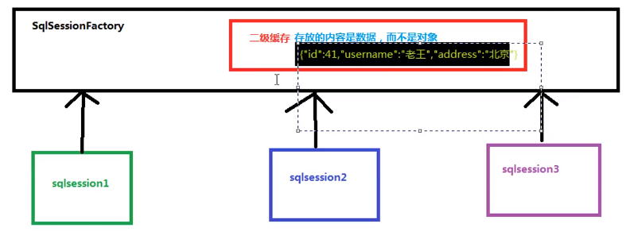

# Mybatis  - 缓存、加载

## 1.延迟加载

问题：在一对多中，当我们有一个用户，它有100个账户。

在查询用户的时候，要不要把关联的账户查出来？

在查询账户的时候，要不要把关联的用户查出来？

在查询用户时，用户下的账户信息应该是，什么时候使用，什么时候查询的。

在查询账户时，账户的所属用户信息应该是随着账户查询时一起查询出来的。

### 1.1.什么是延迟加载？

在真正使用数据时才发起查询，不用的时候不查询，按需加载(懒加载)

配置：

```xml
lazyLoadingEnabled	延迟加载的全局开关。当开启时，所有关联对象都会延迟加载。 特定关联关系中可通过设置 fetchType 属性来覆盖该项的开关状态。	true | false	默认值：false
```

### 1.2.什么是立即加载？

不管用不用，只要一调用方法，马上发起查询

### 1.3.场景分析

在对于的四种表关系中：一对多，多对一，一对一，多对多

一对多，多对多：通常情况下我们都是采用延迟加载

多对一，一对一：通常情况下都是采用立即加载

## 2.缓存

### 2.1.什么是缓存

存在于内存中的临时数据。

### 2.2.为什么使用缓存

减少和数据库的交互次数，提高执行效率。

### 2.3.场景分析

适用于缓存：

* 经常查询并且不经常改变的
* 数据的正确与否对最终结果影响不大的

不使用缓存：

* 数据经常改变
* 数据对结果影响很大的值
* 例如：商品的库存，银行的汇率，股市的牌价

### 2.4.mybatis--缓存

#### 2.4.1.一级缓存

指的是Mybatis中SQLSession对象的缓存。

当我们执行查询之后，查询的记过同时存入到SqlSession为我们提供一块区域中。该区域的结构是一个Map，当我们再次查询同样的数据，mybatis会先去SqlSession中查询是否有，有的化直接拿出来用。

当SqlSession对象消失时，mybatis的一次缓存也就消失了。

#### 2.4.2.一级缓存--清空

<span style="color:red">一级缓存是SqlSession范围的缓存，当调用SqlSession的修改，添加，删除，commit()，close()等方法时，就会清空一级缓存。</span>

#### 2.4.3.二级缓存

指的是Mybatis中SqlSessionFactory对象的缓存，由同一个SqlSessionFactory对象创建的SqlSession共享其缓存。二级缓存是存的数据--而不是对象。

二级缓存区域是根据mapper的namespace划分的，相同namespace的mapper查询数据放在同一个区域，如果使用mapper代理方法每个mapper的namespace都不同，此时可以理解为二级缓存区域是根据mapper划分，也就是根据命名空间来划分的，如果两个mapper文件的命名空间一样，那样，他们就可以共享一个mapper缓存。



#### 2.4.4.二级缓存--使用

* 1.让Mybatis框架支持二级缓存(在SqlMapConfig.xml中配置)

| 设置名       | 描述                                                       | 有效值        | 默认值 |
| ------------ | ---------------------------------------------------------- | ------------- | ------ |
| cacheEnabled | 全局地开启或关闭配置文件中的所有映射器已经配置的任何缓存。 | true \| false | true   |

* 2.让当前的映射文件支持二级缓存(在IUser.xml中配置)

```xml
<cache/>
```

* 3.让当前的操作支持二级缓存(在select标签中配置)

```xml
<useCache="true" />
```

